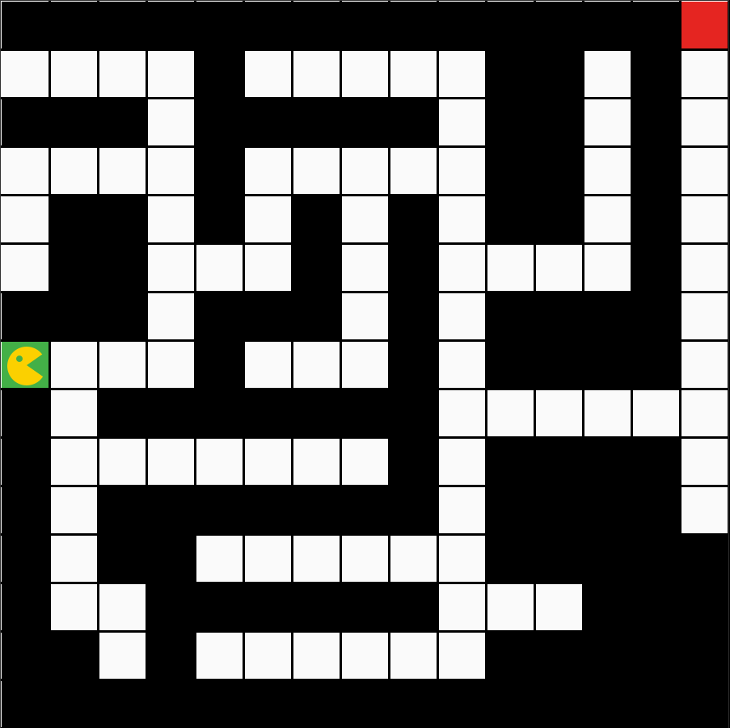
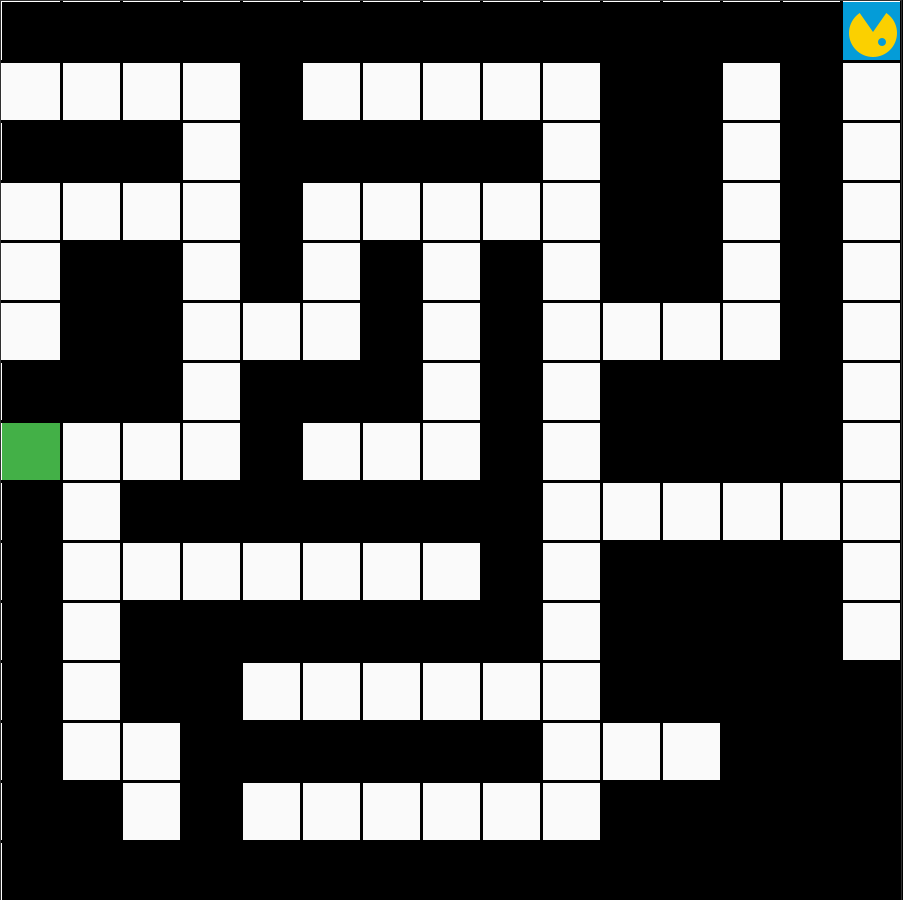

# Studienleistung I: Bouncer | 2. Bouncer im Labyrinth

## Wichtige Informationen zur Bearbeitung der Aufgabe
- [Informationen zur Entwicklungsumgebung *IntelliJ IDEA*](https://elearning.uni-regensburg.de/mod/book/view.php?id=1480675)
- [Informationen zum Im- und Export von Projekten](https://elearning.uni-regensburg.de/mod/book/view.php?id=1480675&chapterid=51551)

## Starterpaket

Ein vorbereitetes Starterpaket zur selbständigen Implementierung der Aufgabe finden Sie [hier](https://github.com/OOP-Wintersemester-2021/Studienleistung-I-Bouncer-2-BouncerImLabyrinth/archive/refs/heads/starter.zip).

## Allgemeine Hinweise zur Studienleistung
In dieser Studienleistung werden Sie drei Programmieraufgaben lösen.
Diese Programmieraufgaben sind auf drei Projekte - pro Teilaufgabe ein Projekt - aufgeteilt.
Um die Aufgaben zu bearbeiten, müssen Sie zuerst das jeweilige Projekt in IntelliJ öffnen.
Diese Projekte sind:
* ```Studienleistung-I-Bouncer-1-BouncerMaltEineSpirale```
* ```Studienleistung-I-Bouncer-2-BouncerImLabyrinth```
* ```Studienleistung-I-Bouncer-3-BouncerFuelltEineGrube```

Für die Teilaufgabe, die in diesem Dokument beschrieben ist, öffnen Sie bitte das Projekt: ```Studienleistung-I-Bouncer-2-BouncerImLabyrinth```

Nutzen Sie zum Lösen der einzelnen Aufgaben die bereitgestellten Klassendateien.
Zum Einreichen Ihrer Aufgaben nutzen Sie die entsprechende Funktion in GRIPS.
Falls Sie Problemen mit dem Starterpaket oder dem Einreichen der Aufgabe haben, können Sie sich in den Handouts auf GRIPS informieren.

Achtung: Eine Verlängerung der Abgabefrist ist nicht möglich.
Einreichungen die uns (zu spät) per E-Mail erreichen, werden nicht mehr berücksichtigt.
Alle nicht eingereichten Aufgaben werden mit nicht bestanden bewertet.
Testen Sie den Upload am besten schon vor Ablauf der Frist in Ruhe: Sie können bis zum Abgabetermin beliebig viele neue Lösungen einreichen.

Bewertungskriterien: Für die gesamte Studienleistung gilt, dass die eingereichten Lösungen nur die in der Aufgabenstellung beschriebenen Probleme lösen sollen.
Lassen Sie keinen Teil der jeweiligen Aufgabe weg und interpretieren Sie die Fragestellung nicht selbstständig.
Bewertet wird, in wie weit Sie das beschriebene Problem vollständig lösen.
Wenn Sie die Aufgaben erfolgreich bearbeitet haben, können Sie Ihre Lösung gerne kreativ gestalten und erweitern; achten Sie dabei darauf, dass die eigentlichen Anforderungen weiterhin erfüllt bleiben.
Die Qualität Ihres Codes fließt in die Gesamtnote mit ein: Nutzen Sie Decomposition um Ihre Programme übersichtlich zu gestalten.
Verwenden Sie sinnvolle Bezeichner für Variablen und Methoden und kommentieren Sie ausreichend.
Beachten Sie dazu die Kriterien für guten und schlechten Code, die in der Vorlesung erwähnt wurden.

Sollten Sie Fragen haben oder Hilfe brauchen, können Sie im Discord unter der Kategorie Support in den Channel Studienleistung uns eine Nachricht hinterlassen.
Wir stehen Ihnen dann zeitnah zur Seite über eine Direktnachricht.

## Ausgangslage

Bouncer steht auf einem grünen Feld, das den Eingang eines verzwickten Labyrinths markiert.
Bouncers Aufgabe ist es das rote Feld, das den Ausgang des Labyrinths markiert, zu erreichen.


| Bouncer steht am Beginn des Labyrinths auf dem grünen Feld | Bouncer steht auf den roten Feld, dem Ausgang des Labyrinth. |
|:------:|:------:|
|  |  |


Die Ausgangsbedingung für diese Aufgabe ist wie folgt:
Bouncer steht auf dem grünen Feld am Eingang des Labyrinths.
Bouncer soll nun das Labyrinth durchqueren und das rote Feld am Ausgang des Labyrinths erreichen.

Ihr Programm soll für beliebige, lösbare Labyrinthe funktionieren und Bouncer zum Ausgang leiten.

**Hinweis:** 
Ein Ausgang von lösbaren Labyrinthen oder Irrgärten - also Labyrinthe, die mindestens einen Ausgang haben und nicht nur in Sackgassen enden - ist garantiert mit der ```Rechte-Hand-Regel``` zu finden.
Das heißt, wenn Sie ein Labyrinth betreten und mit Ihrer rechten Hand die Wand rechts von Ihnen berühren und ständig beim Durchqueren des Labyrinth ständig Kontakt zur Wand halten, werden Sie unweigerlich den/einen Ausgang erreichen.
Das funktioniert selbstverständlich mit der linken Hand und Wand zu Ihrer Linken analog.
Wenden Sie dies aus der Sicht von Bouncer an, um Bouncer zum Ausgang des Labyrinths zu leiten.

## Aufgabe

Lösen Sie folgende Teilaufgaben, um Bouncer durch das Labyrinth zu führen.

1. Bouncer muss Kreuzungen erkennen
2. Bouncer muss bei Kreuzungen immer in die gleiche Richtung abbiegen, falls möglich (```Rechte Hand Regel```) 
3. Sobald Bouncer das rote Feld erreicht hat, färbt Bouncer das rote Feld blau
